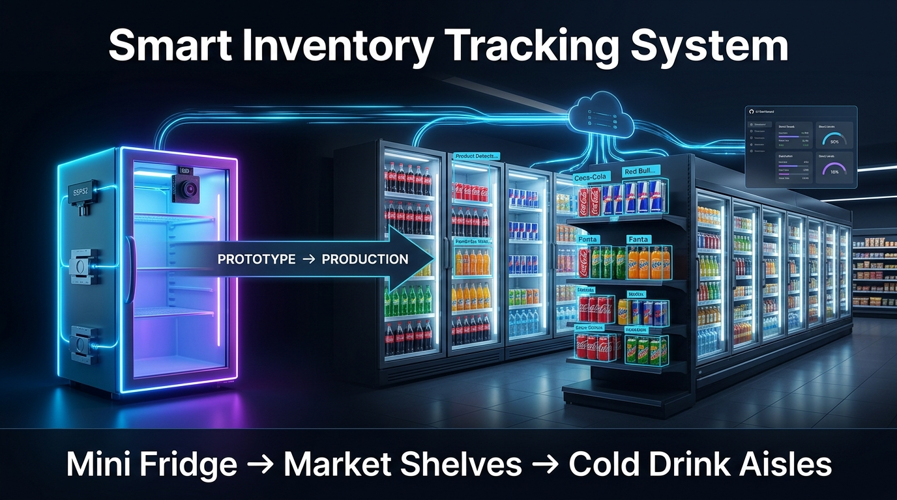
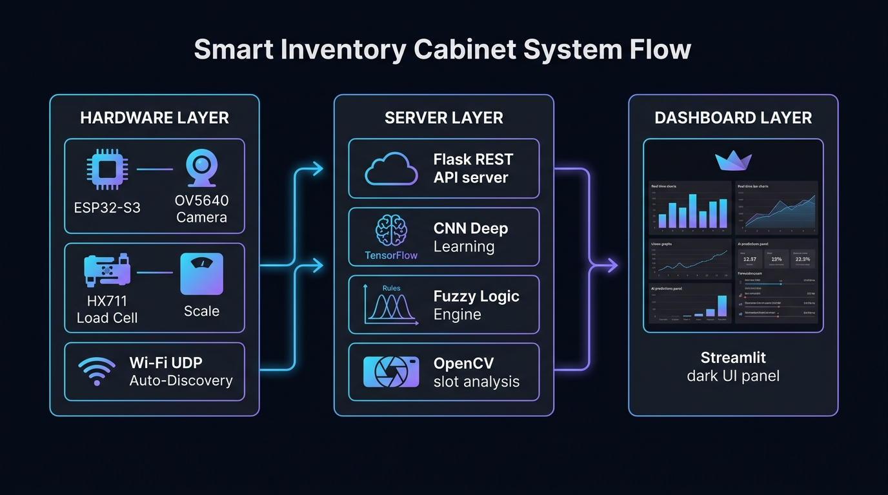

<div align="center">



# 🧠 Sensor & AI Based Smart Inventory Tracking System

### Otonom Raf Takip Sistemi — ESP32-S3 + OV5640 Kamera + HX711 Yük Hücresi + Derin Öğrenme + Bulanık Mantık

> 🇬🇧 [English version → README_EN.md](README_EN.md)

[](https://python.org)
[](https://tensorflow.org)
[](https://flask.palletsprojects.com)
[](https://streamlit.io)
[](https://opencv.org)
[](https://espressif.com)
[](LICENSE)

</div>

---

## 🎯 Proje Özeti

Bu proje, bir raf veya dolap sisteminde **sıfır insan müdahalesi** ile hangi ürünün alındığını tespit eden, anlık stok takibi yapan ve yapay zeka destekli tahminler sunan **tam entegre bir akıllı envanter sistemidir.**

> 💡 **Mevcut Prototip:** Mini buzdolabı üzerinde çalışan PoC (Proof of Concept). Aynı sistem doğrudan market soğuk içecek dolaplarına, süpermarket raflarına ve otomat makinelerine ölçeklendirilebilir — yazılım ya da donanım değişikliği gerekmez.

**Sistem üç entegre katmandan oluşur:**

```
[Donanım Katmanı]          [Sunucu Katmanı]              [Görselleştirme]
ESP32-S3 + OV5640    →    Flask REST API          →    Streamlit Dashboard
HX711 Load Cell      →    CNN Image Analysis      →    Gerçek Zamanlı Stok
Wi-Fi UDP Discovery  →    Fuzzy Logic Engine      →    AI Tahmin Merkezi
ORB Feature Matching →    OpenCV Slot Analysis    →    Canlı İşlem Akışı
```

---

## 🏪 Vizyon: Prototipten Endüstriyel Ürüne



Bu sistem **mevcut hâliyle bir mini buzdolabı prototipidir.** Ancak mimarisi bilinçli olarak ölçeklenebilir tasarlandı:

| Uygulama Alanı | Gerekli Değişiklik | Örnek |
|---|---|---|
| 🧊 Market Soğuk İçecek Dolabı | Daha geniş slot koordinatları + çoklu kamera | Migros, CarrefourSA soğuk reyonu |
| 🛒 Süpermarket Rafı | Slot sayısı artırılır (4 → 12+) | Kuru gıda, atıştırmalık reyonları |
| 🤖 Otomat Makinesi | Kamera açısı optimize edilir | Vending machine AI upgrade |
| 🏥 Hastane Kiosk | Ürün kataloğu değiştirilir | İlaç/sarf malzeme takibi |

> **Temel avantaj:** Rafları saymak için insan gerekmez. Sistem 7/24 otonom çalışır.

---

## 🧠 Nasıl Çalışır? — Adım Adım

### 1️⃣ Ağırlık Tabanlı Tetikleme (Hardware Interrupt)
- **HX711** yük hücresi rafın ağırlığını sürekli ölçer (5 örnekle hareketli ortalama, gürültü bastırma).
- **85 gramdan fazla** değişim tespit edildiğinde ESP32 harekete geçer.
- Bir kutu içecek ortalama **230–290 gram** olduğundan, bu eşik küçük titreşimleri filtreler.

### 2️⃣ Akıllı Fotoğraf Çekimi
- ESP32-S3, **OV5640 kamera** ile **8 ısınma karesi + 150ms bekleme** sonrası fotoğraf çeker (VGA 640×480).
- Bu bekleme, hem müşterinin elinin görüntüye girmesini hem de kamera sensörünün kararlı hale gelmesini sağlar.
- Fotoğraf **Wi-Fi üzerinden HTTP POST** ile Python sunucusuna aktarılır.

### 3️⃣ Görüntü Hizalama (ORB Feature Matching)
- Kapak sallantısından kaynaklı iki fotoğraf arasındaki piksel kayması **ORB algoritması** ile düzeltilir.
- En iyi %20 feature match kullanılarak **homografi matrisi** hesaplanır.
- Bu adım olmadan yanlış slot tespiti olabilir — sistem bunu otomatik çözer.

### 4️⃣ Slot-Bazlı Piksel Fark Analizi (OpenCV)
- Raf **kalibrasyon koordinatlarıyla slotlara bölünür** (`piksel_bulucu.py` ile ayarlanır).
- İki fotoğraf arasındaki mutlak piksel farkı (`cv2.absdiff`) hesaplanır.
- **%8'den fazla** piksel değişimi olan her slot, AI analizine alınır.

### 5️⃣ CNN Görüntü Sınıflandırma (Yapay Zeka Beyni)
- Değişim tespit edilen slot, hem önceki hem sonraki fotoğraftan kırpılır.
- Her kırpım **224×224 piksel** boyutuna getirilip CNN modeline sorulur.
- Model ürünü sınıflandırır + **güven skoru (eminlik %)** üretir.
- `Öncesi DOLU → Sonrası BOŞ`: Ürün **alındı**
- `Öncesi BOŞ → Sonrası DOLU`: Ürün **eklendi**

### 6️⃣ Tartı Tabanlı Çapraz Doğrulama
- AI'nın bulduğu olay sayısı, **HX711 ağırlık değişiminden** hesaplanan ürün adediyle karşılaştırılır.
- Tutarsızlık varsa (örn. AI 2 ürün algıladı ama tartı 1 ürün gösteriyor), **en düşük güven skorlu algılama iptal edilir**.
- Bu fusion mekanizması yanlış pozitif oranını dramatik şekilde düşürür.

### 7️⃣ Bulanık Mantık Sistemi (Fuzzy Logic Engine)
- Stok düzeyi ve tüketim hızı **Mamdani-tipi bulanık çıkarım** ile değerlendirilir.
- **12 kural tabanlı** sistem sipariş aciliyeti skoru (0–100) üretir.
- Saate göre beklenen kullanım yoğunluğu da hesaba katılır.

### 8️⃣ Referans Rotasyonu ve Veri Kaydı
- Başarılı her algılama sonrası `sonrası.jpg` → `öncesi.jpg` olarak kaydedilir.
- Böylece her yeni müşteri, bir öncekinin bıraktığı durumu referans alır.
- `sistem_durumu.json` güncellenir, `satis_gecmisi.csv`'ye zaman damgalı kayıt eklenir.

---

## 🤖 Yapay Zeka Modeli — Teknik Detaylar

### CNN Mimarisi (5 Blok)

```
Input: 224×224×3 (RGB görüntü)
│
├── Blok 1: Conv2D(32) → BatchNorm → MaxPool(2×2)
├── Blok 2: Conv2D(64) → BatchNorm → MaxPool(2×2)
├── Blok 3: Conv2D(128) → BatchNorm → MaxPool(2×2)
├── Blok 4: Conv2D(256) → BatchNorm → MaxPool(2×2)
├── Blok 5: Conv2D(256) → BatchNorm  ← Logo/doku detayları için
│
├── GlobalAveragePooling2D
├── Dense(256) + L2 Regularization + Dropout(0.5)
├── Dense(128) + Dropout(0.3)
└── Dense(11) → Softmax  ← 11 sınıf çıktısı
```

### Overfitting Önleme Stratejisi

| Teknik | Uygulama |
|---|---|
| **L2 Regularization** | Tüm Conv2D ve Dense katmanlarında (λ=1e-4) |
| **Dropout** | 0.5 ve 0.3 oranlarında iki katmanda |
| **BatchNormalization** | Her konvolüsyon bloğunda |
| **Online Augmentation** | Her epoch'ta fotoğraflar farklı görünür |
| **EarlyStopping** | val_accuracy izleme, patience=15 |
| **ReduceLROnPlateau** | Öğrenme hızı adaptif azaltma (factor=0.5) |
| **Stratified Split** | Her sınıftan eşit oranda validation (%20) |

### Veri Seti ve Super Augmentation Pipeline

Orijinal dataset: **Elle çekilen ürün fotoğrafları**
Toplam eğitim seti: **~4.400 fotoğraf (11 kategori × ~400 görüntü)**

Super Augmentation (`super_augment.py`) her orijinal fotoğrafa **16 farklı gerçekçi varyant** üretir:

| # | Teknik | Amaç |
|---|---|---|
| 1 | Karanlık ortam (f: 0.15–0.55) | Gece/düşük ışık koşulları |
| 2 | Aşırı parlak (f: 1.5–2.2) | Güneş ışığı/overexposure |
| 3 | HSV renk & doygunluk kayması | Farklı kamera renk profilleri |
| 4 | Perspektif bozulması | Farklı kamera açısı |
| 5 | Motion blur (7–19px kernel) | Kamera titremesi |
| 6 | Gaussian blur (odak kaybı) | Derinlik odaklanma |
| 7 | Sensör gürültüsü (ESP32 noise) | Düşük kalite CMOS sensör |
| 8 | Vignette (kenar kararması) | Lens distorsiyonu |
| 9 | JPEG artifact (kalite: 15–55) | Düşük kalite Wi-Fi aktarımı |
| 10 | Keskinleştirme | Farklı kamera sharpness |
| 11 | Gölge şeridi | Raf gölgesi/aydınlatma |
| 12 | Kanal bazlı sapma | RGB sensor drift |
| 13 | Döndürme (-35° / +35°) | Kamera açısı sapması |
| 14 | Zoom + kırpma (%8–25) | Farklı uzaklık |
| 15 | Yatay flip | Ürün yönü varyasyonu |
| 16 | Kontrast extremi | HDR/SDR farkı |

---

## 🧮 Bulanık Mantık Motoru — Fuzzy Logic Engine

`fuzzy_engine.py` — **Scikit-fuzzy bağımlılığı olmadan sıfırdan yazılmış** Mamdani-tipi FIS.

### Üyelik Fonksiyonları

**Stok Düzeyi (Giriş 1):**
```
stok_kritik  → trapmf(0.00, 0.00, 0.12, 0.28)  — Kritik bölge
stok_dusuk   → trimf (0.12, 0.28, 0.50)         — Düşük bölge
stok_orta    → trimf (0.35, 0.55, 0.75)         — Orta bölge
stok_yeterli → trapmf(0.60, 0.80, 1.00, 1.00)  — Yeterli bölge
```

**Tüketim Hızı (Giriş 2):**
```
hiz_yavaş  → trapmf(0.0, 0.0, 0.30, 0.90)  — Yavaş tüketim
hiz_normal → trimf (0.5, 1.50, 3.00)        — Normal tüketim
hiz_hızlı  → trapmf(2.0, 3.50, 5.00, 5.00) — Hızlı tüketim
```

### 12 Kuralın Kural Tablosu

| Stok \ Hız | YAVAŞ | NORMAL | HIZLI |
|---|---|---|---|
| **KRİTİK** | ORTA ⚠️ | YÜKSEK 🔴 | YÜKSEK 🔴 |
| **DÜŞÜK** | DÜŞÜK ✅ | ORTA ⚠️ | YÜKSEK 🔴 |
| **ORTA** | DÜŞÜK ✅ | DÜŞÜK ✅ | ORTA ⚠️ |
| **YETERLİ** | DÜŞÜK ✅ | DÜŞÜK ✅ | DÜŞÜK ✅ |

**Çıktı:** Sipariş aciliyet skoru (0–100) — Centroid defuzzification

### Ek Fuzzy Analizler

- **Kapı Yoğunluğu:** Saate göre beklenen kapı açılışıyla anlık açılışı karşılaştırır
- **Trend Analizi:** Son 3 gün ile önceki 4 günü kıyaslayarak satış ivmesi hesaplar
- **Stok Tükenme Tahmini:** `stok / tüketim_saatlik` formülüyle bitiş tarihi tahmin eder
- **24 Saatlik Risk:** Gelecek 24 saatte tükenme olasılığını hesaplar (0–100%)

---

## 📡 UDP Auto-Discovery — IP Girmene Gerek Yok!

Geleneksel IoT sistemlerinde cihaz IP'si elle girilmek zorundadır. Bu sistemde değil:

```
Python Sunucu Tarafı (her 3 saniyede):
  "DOLAP_SERVER:192.168.x.x" → UDP Broadcast → 255.255.255.255:4210

ESP32 Tarafı (sürekli dinleme):
  UDP 4210 portunu dinler
  "DOLAP_SERVER:..." paketini alır
  IP'yi hafızasına kaydeder
  HTTP bağlantısını bu IP'ye kurar
```

**Sonuç:** ESP32'yi ağa bağla, Python sunucusunu başlat — sistem kendini otomatik bulur.

---

## 📊 Streamlit Dashboard — Özellikler

Dashboard dört ayrı sayfa ve iki arayüz moduna (📱 Mobil / 💻 Web) sahiptir:

### ✦ Ana Dashboard
- **Kapı Açılma Sayacı** — Saatlik yoğunluk grafiği (area chart)
- **Canlı Stok Görünümü** — Ürün başına SVG ikonlar, stok sıfırsa grayscale
- **Sipariş Listesi** — Fuzzy skora göre önceliklendirilmiş
- **En Çok Satılan** — Horizontal bar chart (Plotly)

### ❖ Akıllı Tahminler (Fuzzy Logic Center)
- Kapı yoğunluğu fuzzy analizi
- Satış trendi fuzzy analizi
- Fuzzy sipariş öncelikleri ve stok özetleri
- **Dolum tavsiyesi** — Boşluk oranına göre ACİL / KISMİ / OPTIMUM
- **Stok tükenme takvimi** — Her ürün için tahmini bitiş tarihi + 24s risk
- **Mamdani Kural Motor Görselleştirmesi** — Hangi kurallar aktifleşti, ne kadar güçle

### ⚲ Canlı Operasyon
- Son algılamanın detaylı kartı (ürün, slot, ağırlık, eminlik, zaman)
- Tüm geçmiş operasyon akışı (renk kodlu: kırmızı=alındı, yeşil=eklendi)

### ⌘ Kamera & Görüş
- Öncesi/sonrası kamera görüntüleri yan yana
- AI'ın kırptığı her slot (Slot 1, 2, 3) ayrı kart olarak görüntülenir

### Sidebar Özellikleri
- 🇹🇷 / 🇬🇧 Dil seçimi (tüm metin anlık değişir)
- Zaman filtresi: Tüm Zamanlar / Son 7 Gün / Bugün
- Otomatik yenileme (2 saniye interval)
- **Donanım Durumu:** Kamera (ESP32), Load Cell, Veritabanı API canlı durum
- **Full Reset butonu** — API üzerinden tüm veriyi sıfırlar
- **CSV İndirme** — Fuzzy skor raporu export

---

## 🔧 Donanım Gereksinimleri

| Bileşen | Model | Adet | Notlar |
|---|---|---|---|
| Mikrodenetleyici | ESP32-S3 | 1 | Dahili Wi-Fi + Bluetooth |
| Kamera | OV5640 (5MP, VGA 640×480) | 1 | PCB üzerine custom pinout |
| Load Cell Amplifier | HX711 | 1 | 24-bit ADC, 10 Hz örnekleme |
| Yük Hücresi | 1–5 kg | 1 | Raf kapasitesine göre |
| Voltaj Regülatörü | AMS1117 3.3V | 1 | ESP32-S3 güç besleme |
| PCB | Custom / Hazır | 1 | Kamera + ESP32 entegrasyonu |
| Jumper Kablo Seti | — | — | Sensör bağlantıları |

### ESP32-S3 PCB Pin Haritası (OV5640)

```
OV5640 Kamera Pinleri:
PWDN  → GPIO 21    RESET → GPIO 18    XCLK → GPIO 10
SIOD  → GPIO 40    SIOC  → GPIO 39    VSYNC → GPIO 6
HREF  → GPIO 7     PCLK  → GPIO 13

D0 → GPIO 11   D1 → GPIO 9    D2 → GPIO 8    D3 → GPIO 12
D4 → GPIO 17   D5 → GPIO 16   D6 → GPIO 15   D7 → GPIO 14

HX711 DOUT → GPIO 40    HX711 SCK → GPIO 41
AMS1117 3.3V → ESP32-S3 3.3V güç hattı
```

> **Bu pin haritası `ESP32_Akilli_Dolap_FINAL.ino` içindeki gerçek konfigürasyondur.**

---

## 💻 Kurulum

### 1. Repoyu Klonla ve Ortamı Kur

```bash
git clone https://github.com/batuhan-kurt/Inventory-Tracking-System.git
cd Inventory-Tracking-System

python3.11 -m venv ai_ortami
source ai_ortami/bin/activate  # Windows: ai_ortami\Scripts\activate

pip install -r requirements.txt
```

### 2. ESP32 Firmware'ini Yükle

Arduino IDE'de `ESP32_Akilli_Dolap_FINAL/ESP32_Akilli_Dolap_FINAL.ino` dosyasını aç.

Gerekli kütüphaneler (Arduino Library Manager):
- `HX711_ADC` (Olav Kallhovd)
- `ESP32 Board Package` (Espressif Systems)

Wi-Fi bilgilerini güncelle:
```cpp
const char *ssid     = "WIFI_ADINIZ";
const char *password = "WIFI_SIFRENIZ";
// IP'yi elle yazmana gerek yok! UDP Auto-Discovery otomatik bulur.
```

### 3. Slot Koordinatlarını Kalibre Et

```bash
python piksel_bulucu.py
```

Açılan pencerede her ürün slotunun sol-üst ve sağ-alt köşesine tıkla. Koordinatları `api_sunucu.py` içindeki `RAFLAR` sözlüğüne yapıştır.

### 4. Sistemi Başlat

```bash
# Terminal 1: API Sunucusu (ESP32 bu sunucuya bağlanır)
python api_sunucu.py

# Terminal 2: Dashboard
streamlit run dashboard.py
```

### 5. ESP32'yi Aç

Güç ver → Wi-Fi'ye bağlanır → UDP ile Python sunucusunu bulur → İlk fotoğrafı çeker → Sistem hazır.

---

## 🤖 Model Eğitimi

### Tam Pipeline

```bash
# 1. Orijinal fotoğrafları dataset/ klasörüne koy:
#    dataset/CocaCola_Klasik/  dataset/Fanta/  ... (her ürün ayrı klasör)

# 2. Super augmentation — her fotoğraftan 16 varyant üret
python super_augment.py   # → dataset_dengeli/ oluşur

# 3. NumPy matrisine dönüştür
python veri_hazirla.py    # → X_verileri.npy, Y_etiketler.npy

# 4. CNN modelini eğit (50 epoch, early stopping ile ~20-30 epoch)
python beyin_egit.py      # → akilli_dolap_beyni.keras
```

---

## 📊 Desteklenen Ürün Kategorileri

| Kategori | Ürün |
|---|---|
| `CocaCola_Klasik` | Coca-Cola Klasik |
| `CocaCola_Zero` | Coca-Cola Zero |
| `Pepsi` | Pepsi |
| `Fanta` | Fanta |
| `RedBull_Klasik` | Red Bull Classic |
| `RedBull_White` | Red Bull White Edition |
| `RedBull_Blue` | Red Bull Blue Edition |
| `RedBull_Lilac` | Red Bull Lilac Edition |
| `RedBull_Pembe` | Red Bull Pink/Summer Edition |
| `Nescafe_Klasik` | Nescafé Soğuk Kahve |
| `Bos_Raf` | Boş raf tespiti |

> Yeni ürün eklemek için: ilgili fotoğrafları `dataset/YENI_URUN/` klasörüne koy, pipeline'ı çalıştır.

---

## 📁 Proje Yapısı

```
Inventory-Tracking-System/
│
├── 📡 FIRMWARE
│   ├── ESP32_Akilli_Dolap_FINAL.ino   # Ana firmware (OV5640 + HX711 + UDP Auto-Discovery)
│   └── legacy/
│       ├── esp32_hx711_main.cpp       # Eski ESP32 firmware (arşiv)
│       ├── veri_denge.py              # Eski basit augmentation (super_augment.py ile değiştirildi)
│       ├── tam_otonom_dolap.py        # Bağımsız analiz motoru (api_sunucu.py'ye entegre edildi)
│       ├── tahmin_yap.py              # Tekil görüntü test aracı (arşiv)
│       └── tahmin_yap_toplu.py        # Toplu test aracı (arşiv)
│
├── 🧠 AI & MODEL
│   ├── beyin_egit.py          # 5-blok CNN eğitimi (online augmentation)
│   ├── super_augment.py       # 16 teknikli veri artırımı pipeline'ı
│   └── veri_hazirla.py        # Dataset → NumPy dönüştürücü
│
├── 🖥️ BACKEND
│   ├── api_sunucu.py          # Flask API (UDP broadcast + slot analizi + ORB hizalama)
│   ├── fuzzy_engine.py        # Mamdani FIS (sıfırdan yazılmış, 12 kural)
│   └── piksel_bulucu.py       # İnteraktif slot kalibrasyon aracı
│
├── 📊 DASHBOARD
│   └── dashboard.py           # 1118 satır Streamlit premium UI
│
├── 📂 DATA
│   ├── urun_katalogu.json     # Ürün metadata + fiyat + kritik eşik
│   ├── sistem_durumu.json     # Anlık stok durumu
│   └── satis_gecmisi.csv      # Zaman damgalı satış geçmişi
│
├── 📚 DOCS
│   ├── docs/BOM.xlsx          # Bill of Materials (donanım maliyet listesi)
│   ├── docs/hero_banner.jpg   # Vizyon görseli
│   └── docs/architecture_diagram.jpg  # Sistem mimarisi
│
└── requirements.txt           # Python bağımlılıkları (Python 3.11)
```

---

## 🚀 API Endpoint Listesi

| Method | Endpoint | Açıklama |
|---|---|---|
| `POST` | `/tetikle` | ESP32'den gelen fotoğraf + ağırlık işleme |
| `POST` | `/sifirla` | Referans fotoğrafı sil (dolap dolduruldu) |
| `POST` | `/tam_sifirla` | Tüm veriyi sıfırla (stok, CSV, fotoğraflar) |
| `GET` | `/durum` | Anlık sistem durumu JSON |

---

## 🛠️ Tech Stack

**Donanım:**
`ESP32-S3` · `OV5640 5MP Camera` · `HX711 24-bit ADC` · `Load Cell 1-5kg` · `Wi-Fi 802.11 b/g/n`

**AI / ML:**
`TensorFlow 2.16+` · `Keras` · `Custom CNN (5-block)` · `OpenCV 4.8+` · `NumPy` · `scikit-learn`

**Backend:**
`Flask` · `UDP Broadcast` · `ORB Feature Matching` · `Mamdani FIS (custom)`

**Dashboard:**
`Streamlit` · `Plotly` · `Pandas` · `SVG Icons (custom)` · `Glassmorphism UI`

**Veri:**
`JSON` · `CSV` · `NumPy .npy`

---

## 📝 Lisans

**© 2026 Batuhan Kurt — Tüm Haklar Saklıdır.**

Bu proje ve içindeki kaynak kodlar telif hakkı yasaları kapsamında korunmaktadır.  
Kişisel inceleme ve eğitim amaçlı görüntülenebilir; ancak **izin alınmadan ticari amaçla kullanılamaz, kopyalanamaz, dağıtılamaz veya değiştirilemez.**  
İşbirliği ve lisanslama talepleri için iletişime geçin.

---

<div align="center">

**Batuhan Kurt** — Sensor & AI Based Smart Inventory Tracking System  
*ESP32-S3 + Deep Learning + Fuzzy Logic + IoT*  
🔗 [github.com/batuhan-kurt](https://github.com/batuhan-kurt)

</div>
